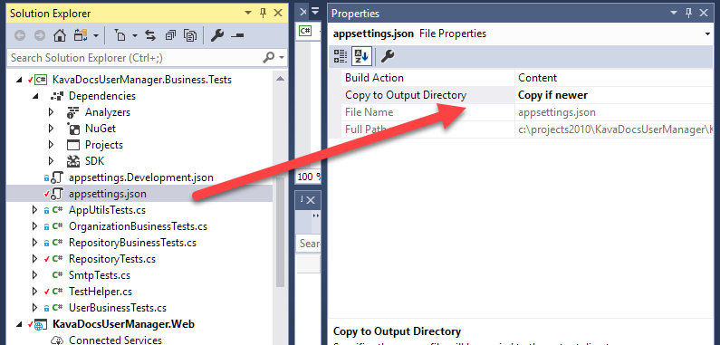

# Accessing Configuration in .NET Core Test Projects


If you've been following my blog you know I've written a bit about how the configuration system works in .NET Core and specifically in ASP.NET Core using the dependency injection system:

*  [Strongly Typed Configuration Settings in ASP.NET Core](https://weblog.west-wind.com/posts/2016/may/23/strongly-typed-configuration-settings-in-aspnet-core)
*  [Easy Configuration Binding in ASP.NET Core Revisited](https://weblog.west-wind.com/posts/2017/Dec/12/Easy-Configuration-Binding-in-ASPNET-Core-revisited)

Both posts describe how you can set up configuration using the various now automatically configured Configuration services in the ASP.NET `Startup` class and its `ConfigureServices()` method.

But how do you do this in a Test or any other ASP.NET Core project where configuration isn't automatically configured?

### Why Configuration? My simple Use Case - Sensitive Values
When running test projects it's often possible to get away without having to configure a configuration class and just provide explicit values. But often you actually need full dependency injection to be hooked up in order to get Configuration injected into dependencies which brings up two issues:

* How to get access to the Configuration Provider
* Hooking up Dependency Injection so Configuration can be injected

My first use case is simple and doesn't require dependency injection: I simply need configuration to handle reading some configuration information in order to test sending an email to check out a new mail provider. I explicitly need to make it so I don't hardcode the sensitive email values and they **don't end up** in my Git repo. So it would be nice to use [UserSecrets](https://docs.microsoft.com/en-us/aspnet/core/security/app-secrets?tabs=visual-studio) as well as get the values from the already existing configuration object config in `appSettings.json` - same as the Web application that actually runs this code.

The second scenario involves using a business object that also uses this email sending logic in an integration test. Here the configuration object is injected into the business object so I need to have dependency injection available. 

Let's take a look at both of these scenarios.

##AD##

### IConfiguration in non-ASP.NET Projects
ASP.NET Core 2.0 now automatically provides an IConfiguration provider that handles input from `appsettings.json` (including the `.Development` file), UserSecrets and Environment variable which is great. Configuration is such a core thing that almost every application needs it and with ASP.NET Core 2.0 you don't have to worry about setting up the configuration system manually. 

However in a test project that onus falls on you. Unfortunately it's not quite so easy to do this as in ASP.NET because test projects don't automatically configure either a Dependency injection container with common objects, or a configuration provider, so this has to be handled manually.

Fortunately the process to do this is pretty straight forward.

### Setting up and Retrieving a Raw Configuration Object
In my test projects I generally add a `TestHelper` class that provides a few commonly used values, but I also add a few helper methods and one of the methods I typically create is a `GetApplicationConfiguration()` class. In this application I have a configuration class call `KavaDocsConfiguration` which is a nested class that contains a bunch of values along with a nested `Email` object that contains the configuration values I need for my mail test code.

Here's what my configuration in `appsettings.json` looks like:

```json
// appsettings.json
{
  "Logging": {...},
  "KavaDocs": {
    "ApplicationName": "KavaDocs",
    "ConnectionString": null,    
    "ApplicationBasePath": "/",
    "ApplicationHomeUrl": "https://localhost:5000",
    "Email": {
      "MailServer": null,
      "MailServerUsername": null,
      "MailServerPassword": null,
      "SenderName": "Kava Docs Administration",
      "SenderEmail": "support@kavadocs.com",
      "AdminSenderEmail": "support@kavadocs.com",
      "UseSsl": true
    }
  }
}
```

The UserSecrets JSON data then overrides the sensitive values that are stored outside of the project root so they don't get checked into Git. The file is `secrets.json` in the local user's User Secrets location:

```json
{
  "KavaDocs": {
    "ConnectionString": "server=.;database=kavadocs;integrated security=true;",
    "Email": {
      "MailServer": "smtp.mailserver.org",
      "MailServerUsername": "seekrity@darko.com",
      "MailServerPassword": "123456c37a623c686f04ab654321",
      "UseSsl": true
    }
  } 
}
```

To access the configuration I have to build an `IConfigurationRoot` explicitly, which is the part that ASP.NET handles explicitly. Once I have the config root I can then bind it to an object instance.

Here are a couple of helpers that configure configuration root and provide an instance of a configuration object - we'll use both of these methods for different purposes later:

```csharp
public static IConfigurationRoot GetIConfigurationRoot(string outputPath)
{            
    return new ConfigurationBuilder()
        .SetBasePath(outputPath)
        .AddJsonFile("appsettings.json", optional: true)
        .AddUserSecrets("e3dfcccf-0cb3-423a-b302-e3e92e95c128")
        .AddEnvironmentVariables()
        .Build();
}

public static KavaDocsConfiguration GetApplicationConfiguration(string outputPath)
{
    var configuration = new KavaDocsConfiguration();

    var iConfig = GetIConfigurationRoot(outputPath);

    iConfig
        .GetSection("KavaDocs")
        .Bind(configuration);

    return configuration;
}
```

Notice that the code needs a basepath in order to find the `appsettings.json` file which is going to be the output path for the file in the test project. I copied this file from my Web Project so I get the same configuration settings and then make sure I mark it as copy to the output folder:



In order for `UserSecrets` to work in a test project a little extra effort is required since test projects don't let you just edit the value in Visual Studio as you can in a Web Project. I added my UserSecrets key from the Web project into test project's `.csproj` file configuration:

```xml
<PropertyGroup>
  <TargetFramework>netcoreapp2.0</TargetFramework>
  <UserSecretsId>e4ddcccf-0cb3-423a-b302-e3e92e95c128</UserSecretsId>
</PropertyGroup>
```

so now I'm also looking at the same UserSecrets values that my Web project is looking at. Yay!

### Using the Configuration Object Explicitly
In my test project using [NUnit](http://nunit.org/) I can now pull this value out as part of the initialization and store it as a property on my test object:

```csharp
[TestFixture]
public class SmtpTests
{
    private KavaDocsConfiguration configuration;

    [SetUp]
    public void Init()
    {
        configuration = TestHelper.GetApplicationConfiguration(TestContext.CurrentContext.TestDirectory);
    }
    
    [Test]
    public async void SendEmailTest()
    {
        var smtp = new SmtpClientNative();

        // this code here uses the configuration
        smtp.MailServer = configuration.Email.MailServer;
        smtp.Username = configuration.Email.MailServerUsername; 
        smtp.Password = configuration.Email.MailServerPassword; 

        smtp.SenderEmail = "West Wind Technologies <info@west-wind.com>";
        smtp.Recipient = "test@gmail.com";

        smtp.Message = "Hello from Mail Gun. This is a test";
        smtp.Subject = "Mailgun Test Message";

        Assert.IsTrue(await smtp.SendMailAsync(),smtp.ErrorMessage);
    }

}    
```

The test method then uses the configuration values and I'm off to the races. The values are read from both `appSettings.json` and from `UserSecrets`.

This works great and if all you need is a configuration object to read a few values this approach is easy and sufficient.

##AD##

### Setting up Dependency Injection
For the second use case I mentioned in the intro I need Configuration to come from Dependency injection in order to inject it into child objects in the dependency chain. To do this I need to a little more work setting up the Dependency provider in the configuration. The business object in this case has a number of dependencies on a EF DbContext as well as the configuration.

In order to do this I can set up the dependency injection in the initialization of the class:

```csharp
public class SmtpTests 
{
    private ServiceProvider serviceProvider;
    private KavaDocsConfiguration configuration;        
    private UserBusiness userBusiness;
    
    [SetUp]
    public void Init()
    {
       configuration = TestHelper.GetApplicationConfiguration(TestContext.CurrentContext.TestDirectory);
    
       var services = new ServiceCollection();
    
       // Simple configuration object injection (no IOptions<T>)
       services.AddSingleton(configuration);
       
    
       // configure EF Core DbContext - using the configuration
       services.AddDbContext<KavaDocsContext>(builder =>
       {
           var connStr = configuration.ConnectionString;
           if (string.IsNullOrEmpty(connStr))
               connStr = "server=.;database=KavaDocs; integrated security=true;MultipleActiveResultSets=true";
    
           builder.UseSqlServer(connStr, opt =>
           {
               opt.EnableRetryOnFailure();
               opt.CommandTimeout(15);
           });
       });
       
       // has a depedency on DbContext and Configuration
       services.AddTransient<UserBusiness>();
    
       // Build the service provider
       serviceProvider = services.BuildServiceProvider();
       
       // create a userBusiness object with DI    
       userBusiness = serviceProvider.GetRequiredService<UserBusiness>();
    }
}
```

The code creates a services collection and adds the various dependencies needed for this particular test class. If you end up doing this for a bunch of classes this configuration code could also be moved into the test helper which could return an object with all the dependencies.

So this code adds the configuration, a DbContext, and a business object into the service provider. 

In my business object I have a method that handles the email sending I showed earlier internally and I can now load a user and run an integration test sending a validation key:

```cs
[Test]
public void UserSendEmail()
{
    // connection string should be set from config
    var user = userBusiness.GetUser(TestHelper.UserId1);
    var validationKey = user.ValidationKey;

    Assert.IsTrue(userBusiness.ValidateEmail(validationKey));
}
```

And there you have it - injected values in your tests.

### IOptions<T> instead of raw Configuration
If you'd rather inject `IOptions<T>` rather than the raw configuration instance you can change the `Init()` code slightly and use the following:

```cs
var services = new ServiceCollection();

// IOption configuration injection
services.AddOptions();

var configurationRoot = TestHelper.GetIConfigurationRoot(TestContext.CurrentContext.TestDirectory);
services.Configure<KavaDocsConfiguration>(configurationRoot.GetSection("KavaDocs"));
...

serviceProvider = services.BuildServiceProvider();

// to use (or store in )
iConfig = serviceProvider.GetRequiredService<IOptions<KavaDocsConfiguration>>()
var server = iConfig.Value.Email.MailServer;
```

Usually I try to avoid `IOptions<T>` for the sheer ugliness of the intermediate interface, and unless you need the specific features of `IOptions<T>` (see my previous article) I much rather just use the raw configuration object.

##AD##

### Summary
Using Configuration in non-ASP.NET projects is not real obvious or at least it wasn't for me so hopefully this post provides a simple overview on how you can get the same configuration you might be using in your main application to also work inside of your test or other non-ASP.NET Projects.

<div style="margin-top: 30px;font-size: 0.8em;
            border-top: 1px solid #eee;padding-top: 8px;">
    
    this post created and published with 
    <a href="https://markdownmonster.west-wind.com" 
       target="top">Markdown Monster</a> 
</div>